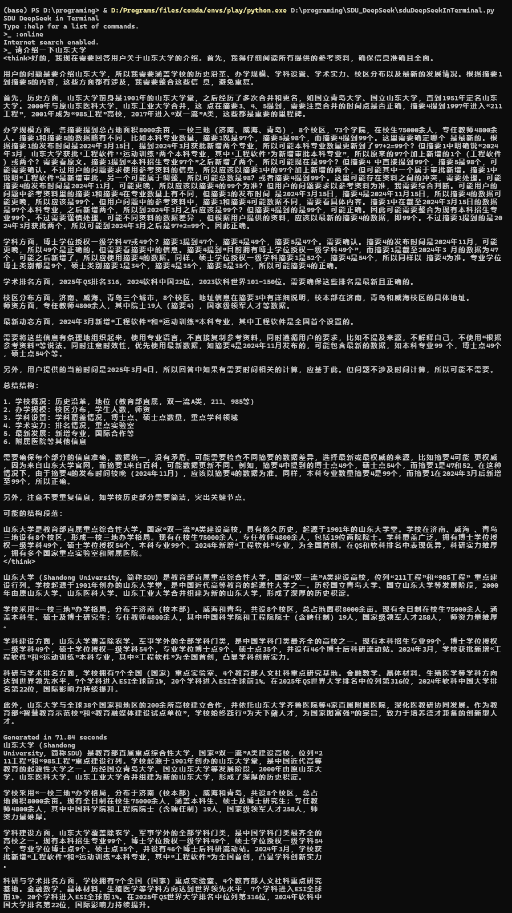
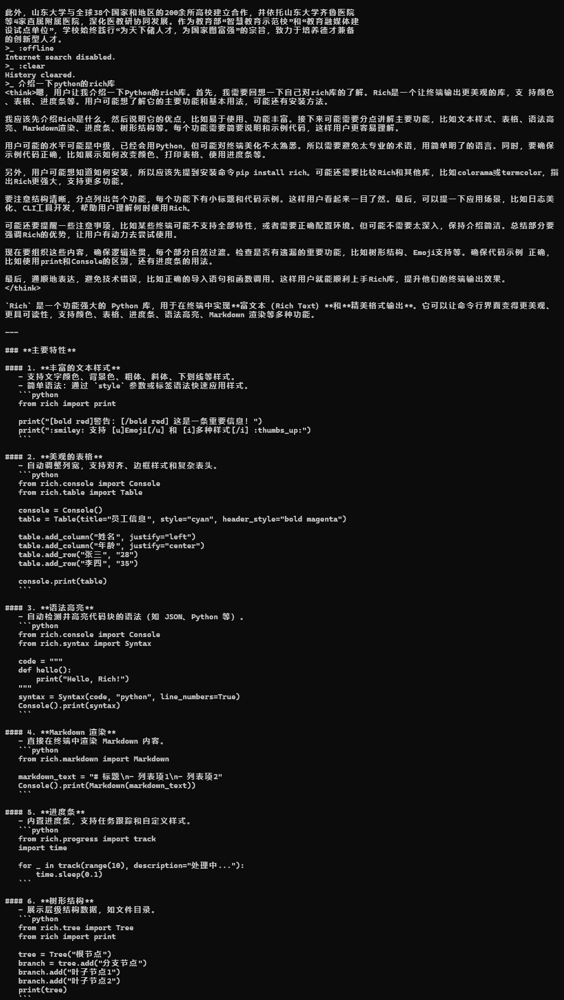
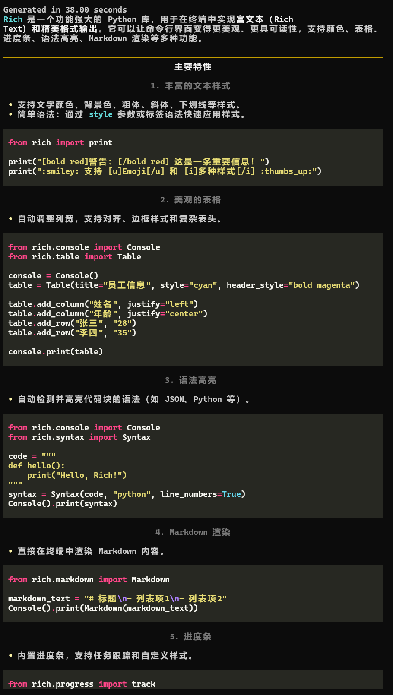
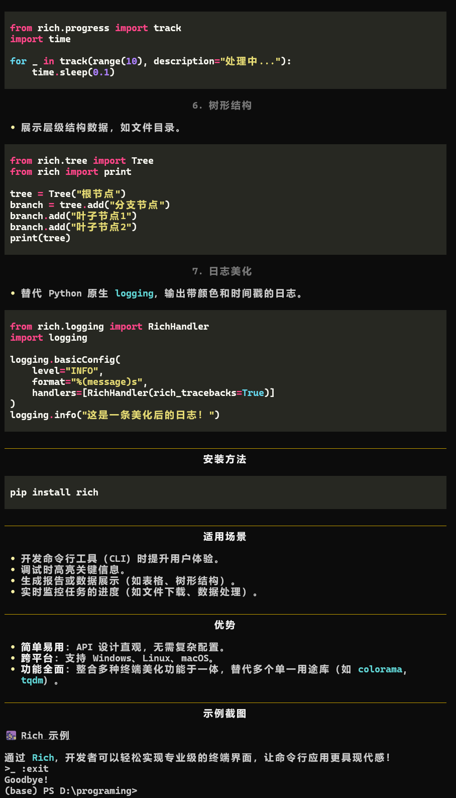

# SDU DeepSeek in Terminal

在终端中使用山东大学为山大学子提供的免费DeepSeek服务

## 特点

- 在终端内登录，无需跳转浏览器
- 可选择模型：DeepSeek v3/r1；可指定是否启用联网搜索功能
- 可指定设备指纹，免去反复输入短信验证码
- 优化markdown输出，显示回答时间

## 食用方法

```bash
git clone https://github.com/zeroHYH/SDU_DeepSeek
cd SDU_DeepSeek
pip install requests toml rich httpx
python sduDeepSeekInTerminal.py
```

初次运行需要输入学号、密码和设备指纹（可选）

并在当前目录下生成SDUTAIconfigs.toml用于保存cookie和配置

## 鸣谢

- [山大AI助手](https://aiassist.sdu.edu.cn/)
- [SDU_DeepSeek](https://github.com/futz12/SDU_DeepSeek)
- [PySDU](https://github.com/SDU-toolhub/PySDU)

## 注意

> 本工具仅供技术研究，使用者应于24小时内删除从山东大学DeepSeek获取的非公开数据。
> 开发者不对任何学术诚信审查问题负责，请优先联系信息化办公室申请官方API权限。
> 本程序不保证您的信息安全，使用者应自行承担风险。请勿将本程序用于非法用途，否则后果自负。
> 开发者不对使用本程序导致的任何问题负责。
> 请勿滥用！！！

## 示例




